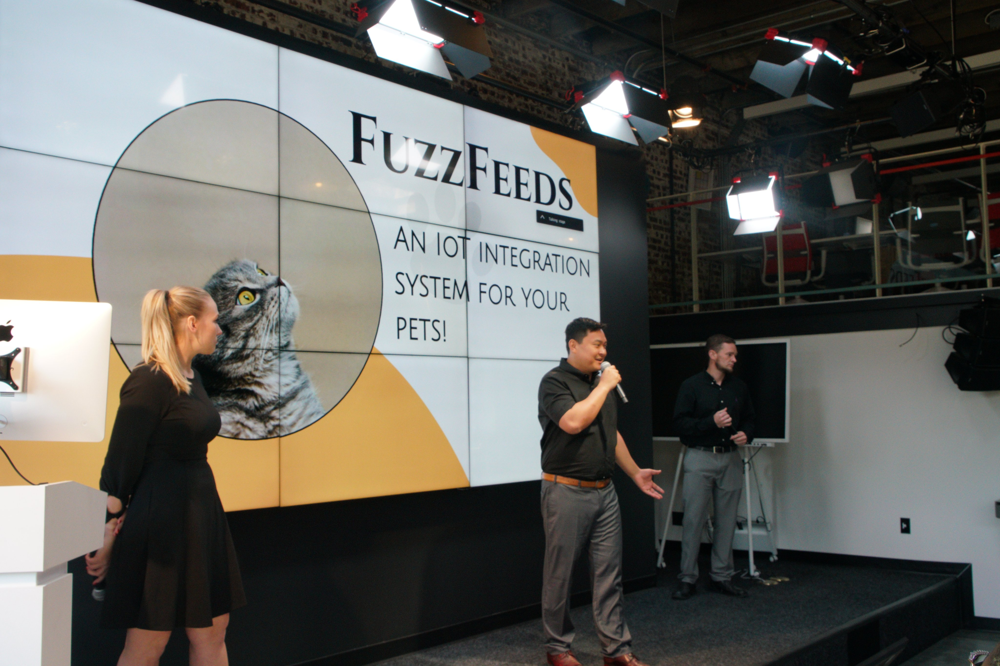

<a href="https://github.com/brerickner/">
    
</a>

#  FuzzFeeds  
<p align="center">
<a href="https://github.com/brerickner/fuzzfeeds">
    </a>
</p>

<p align="center">
<a href="https://scrutinizer-ci.com/g/brerickner/fuzzfeeds/?branch=master"></a>
<a href="https://scrutinizer-ci.com/g/brerickner/fuzzfeeds/build-status/master"></a>
<a href="https://scrutinizer-ci.com/code-intelligence"></a>
</p>

<p align="center">
<a href="#introduction-cat2">Introduction</a> •
<a href="##fuzzfeeds-team...">FuzzFeeds Team</a> •
<a href="#hardware-components">Hardware Components</a> •
<a href="#features--rocket">Features</a> •
<a href="#licensescroll">License</a>
</p>

<p align="center">
</p>

`Fuzz Feeds is an IoT (Internet-of-things) integration system designed to put your pets on the map`

`Like, literally!`  
  
`Customize which figures of speech your pet will tweet in response to the latitude and longitude coordinates collected from their wearable 'FuzzFeeds' device`

## :smirk_cat: The FuzzFeeds Team
> :woman_technologist: Bre Rickner - [Github](https://github.com/brerickner) / [LinkedIn](https://www.linkedin.com/in/brerickner)  
> :man_technologist: Sang Nguyen - [Github](https://github.com/sang-nguy0920) / [LinkedIn](https://www.linkedin.com/in/sang-n-8666631a9)  
> :man_technologist:
Justin Thurman - [Github](https://github.com/Justin4587) / [LinkedIn](https://www.linkedin.com/in/justin-thurman-293942123/)  
>:cat2: Kiddy Rick -------------------> [Twitter](https://twitter.com/kiddy_rick)  

## :pager: Hardware Components
What's required:  
- An IoT device, such as a microcontroller, with WiFi capabilities, plus the ability to collect and output GPS data via standard NMEA string.

### FuzzFeeds Hardware List:

> *  [Adafruit Feather HUZZAH](https://www.adafruit.com/product/2821)
> *  [Raspberry Pi Zero](https://www.raspberrypi.com/products/raspberry-pi-zero/)
> *  [GPS Breakout Board](https://www.adafruit.com/product/746)

## :floppy_disk: Software Components
1. [GPS_API.py](https://github.com/brerickner/fuzzfeeds/blob/master/gps_pi/GPS_API.py)
    - This File consists of API calls for the GPS Parsing Functionality
2.  [connections.py](https://github.com/brerickner/fuzzfeeds/blob/master/gps_pi/connections.py) 
    - This script uploads Latitude and Longitude values to the Thingspeak cloud storage
3. [ThingSpeak](https://thingspeak.com/)
    - Sends microcontroller's GPS data privately to ThingSpeak cloud, where it is analyzed with MATLAB before triggering a reaction.


## :iphone: Usage
1.  Assign preferences in ThingSpeak allowing POST request to be made to Twitter on your pets behalf. This can be done simply by asking for your pets consent to post on their behalf :smile_cat:
2.  Activate "smart-pet" device by turning on physical device then waiting for the device to get a 'fix'(light will slow blink).
3.  Once device has a 'fix', you can run the **_connections.py_** script from within **gps_pi** directory, like so:  

    ```sh
    # Move to inside the 'gps_pi' directory
    $ cd gps_pi  

    # Run program continuously while tracking pet
    $ ./connections.py  

    # Exit the program
    $ (Ctrl + C)
    ```

4.  Gather the latitude and longitude values of your pets favorite locations
5.  In ThingSpeak, program *trigger* to *tweet* whenever your pets 'FuzzFeeds' device registers being at those coordinates.
 


## :scroll: License
[MIT](https://choosealicense.com/licenses/mit/)
